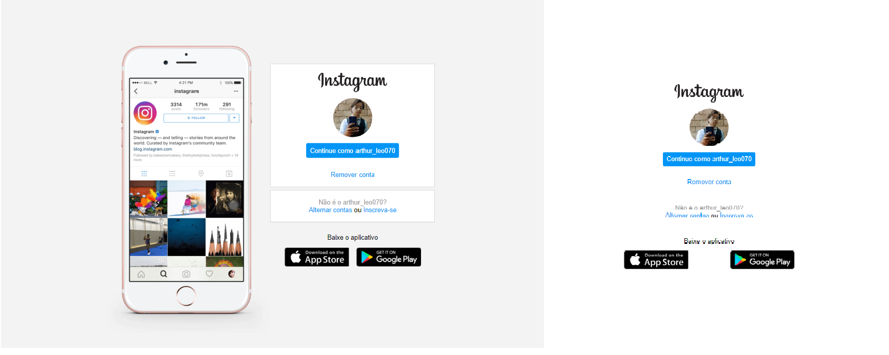

<h1 align="center"> 
    Recriando-a-página-inicial-do-Instagram
</h1>

  <a href="#-About">About</a>&nbsp;&nbsp;&nbsp;|&nbsp;&nbsp;&nbsp;
  <a href="#-Project">Project</a>&nbsp;&nbsp;&nbsp;|&nbsp;&nbsp;&nbsp;
  <a href="#-Technology">Technology</a>

    

<h5 style="text-align: center"> Img Instagram </h5>

## 📚 About

Esse repositório é dedicado em base em exércicios na realização exércicios do Projeto: **Recriando a página inicial do Instagram** da plataforma Digital Inovation One. Onde foi ministrado por Gabriela Pinheiro Professora e Front-End Engineer, em Agosto de 2020. O projeto tem como foco trabalhar com _**responsividade**_ utilizando o **@media (media queries)** e a utilização do **flexbox** com **CSS**.

Para ter acesso a conteúdo similares, acesse [DIO](https://web.dio.me/labs)

## 💻 Project

O projeto **Recriando a interface do Instagram** foi utilizado a partir da **IDE**:

- VSCode ( Visual Studio Code )

## 🚀 Technology

O projeto foi desenvolvido a partir das tecnologias:

- *HTML5*
- *CSS3*

## 📚 About

This repository is dedicated on the basis of exercises in carrying out the exercises of the Project: **Recreating the Instagram homepage** of the Digital Inovation One platform. Where it was taught by Gabriela Pinheiro Professor and Front-End Engineer, in August 2020. The project focuses on working with _**responsiveness**_ using **@media (media queries)** and using **flexbox** with **CSS**.

*To access similar content, go to [DIO](https://web.dio.me/labs)*

## 💻 Project

The project **Recreating the Instagram interface** was used from the **IDE**:

- VSCode ( Visual Studio Code )

## 🚀 Technologies Used:

*The project was developed based on technologies:*

- *HTML5*
- *CSS3*

--------------

Developed by :atom_symbol: [**Arthur Silva**]([arthursj (ArthurSilva) (github.com)](https://github.com/arthursj))
